 

# Hi, I'm Amantai Toktosunov

Software developer focused on mobile and systems programming. I build cross-platform apps with Flutter & Dart, work on games and desktop tools in C++ with Raylib, and have backend experience with Node.js, TypeScript, and MongoDB. Daily tools: Git, VS Code, and CLion.

 

 

# 💻 Tech Stack:

---

